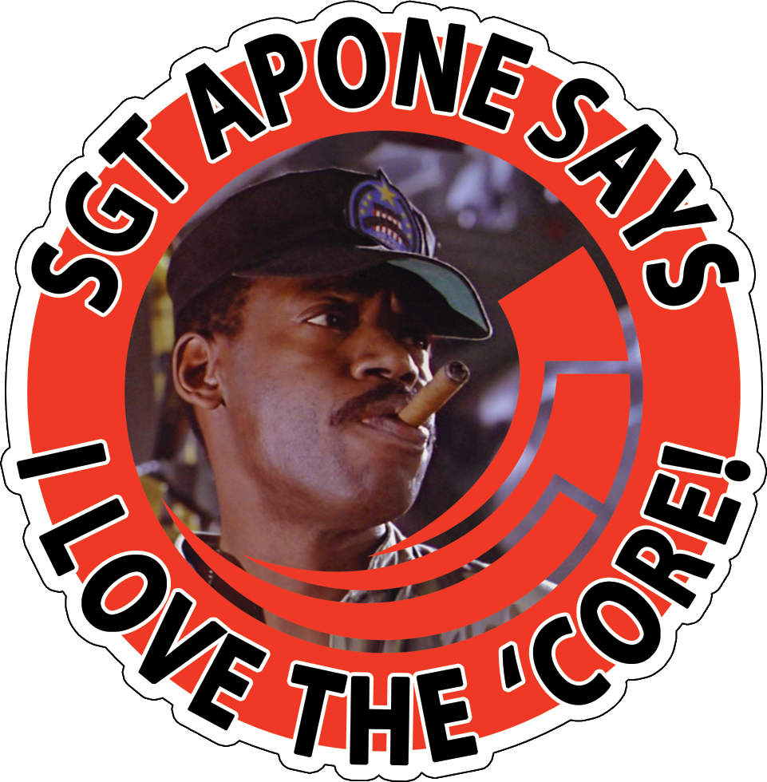
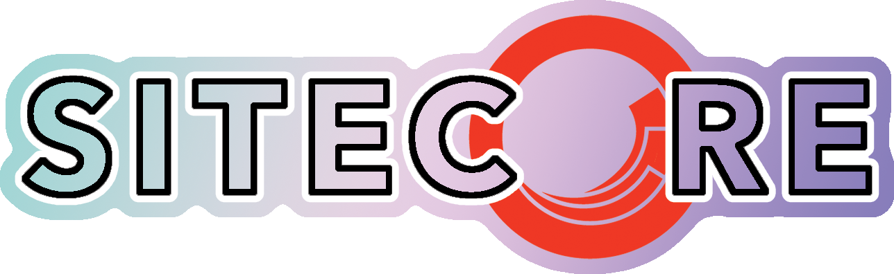
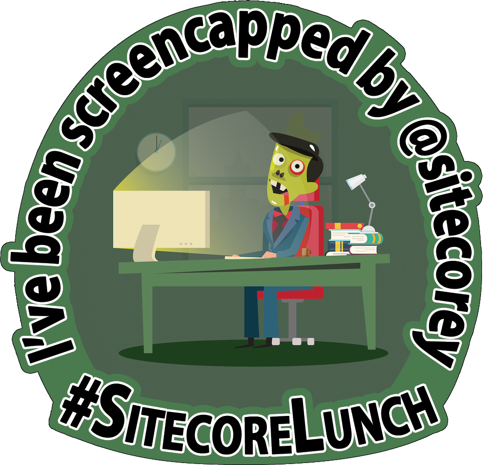
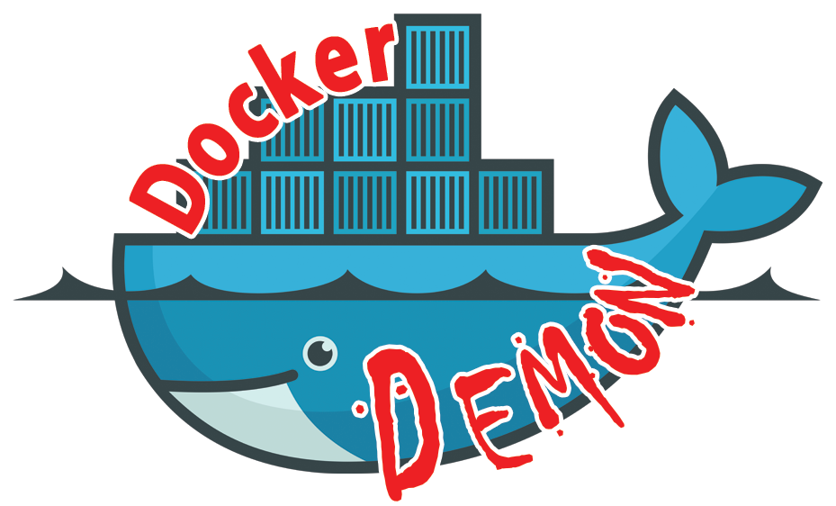
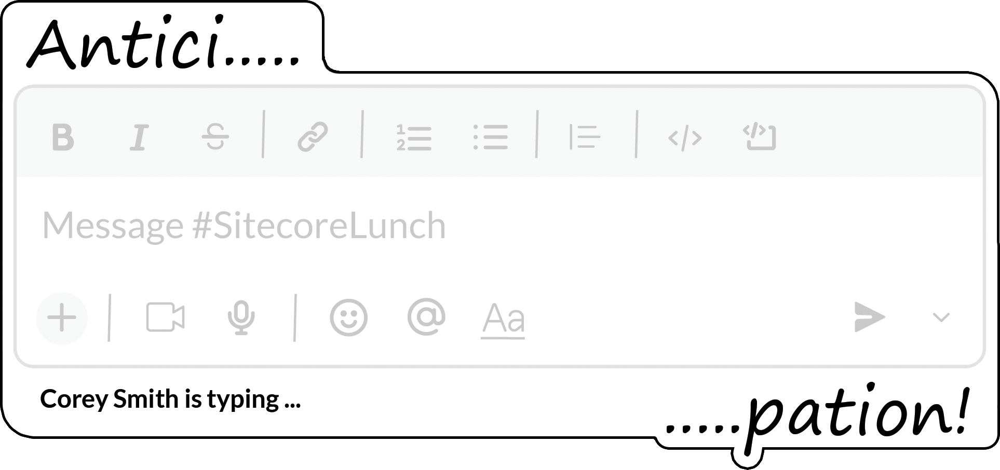

# Sitckers etc from the 2022 Sitecore Symposium

Another year, some more silly stickers for Symposium and the MVP summit. [The ones from previous years are <a href="https://github.com/jermdavis/SymposiumStickers2017">here (2017)</a>, <a href="https://github.com/jermdavis/SymposiumStickers2018">here (2018)</a> and <a href="https://github.com/jermdavis/SymposiumStickers2019">here (2019)</a>]

The files are available in Photoshop format, and as PNGs below.
They're under an "<a href="http://creativecommons.org/licenses/by-sa/4.0/">attribution, share-alike</a>" license so if you've got customisations you'd like to make, go ahead.
Just give the artwork back to the community and link back to this repo.

For Symposium, I used <a href="https://www.stickermule.com/uk/custom-stickers">Sticker Mule</a> to print copies of these, and the quality was great.
It's a bit hidden, but they also have <a href="https://www.stickermule.com/samples/stickers">an "order samples" option</a>, which lets you get smaller numbers if you only need a few (or to check out your designs).

## Stickers

1. **Sgt. Apone loves the 'Core** 
    
   [<a href="1.AponeLovesTheCore.psd">PSD File</a>]

2. **Sparkly Sitecore** 
   (Print this one using [holographic stickers](https://www.stickermule.com/uk/products/holographic-stickers) - remove the coloured backrgound layer first) 
    
   [<a href="2.Sparklycore.psd">PSD File</a>]

3. **Corey's Screencap** 
    
   [<a href="3.CoreyScreencap.psd">PSD File</a>]

4. **Docker Demon** 
    
   [<a href="4.DockerDemon.psd">PSD File</a>]

5. **Worlds Okayest Sitecore Architect** 
    
   [<a href="5.OkayestArchitect.psd">PSD File</a>]

6. **Corey Typing** 
    
   [<a href="6.CoreyTyping.psd">PSD File</a>]

## T-Shirts

7. **Worlds Okayest Sitecore Architect** 
    
   [<a href="5.OkayestArchitect-tshirt.psd">PSD File</a>]

----

Logos and images used here belong to their respective companies.

----

 This work is licensed under a <a rel="license" href="http://creativecommons.org/licenses/by-sa/4.0/">Creative Commons Attribution-ShareAlike 4.0 International License</a>.